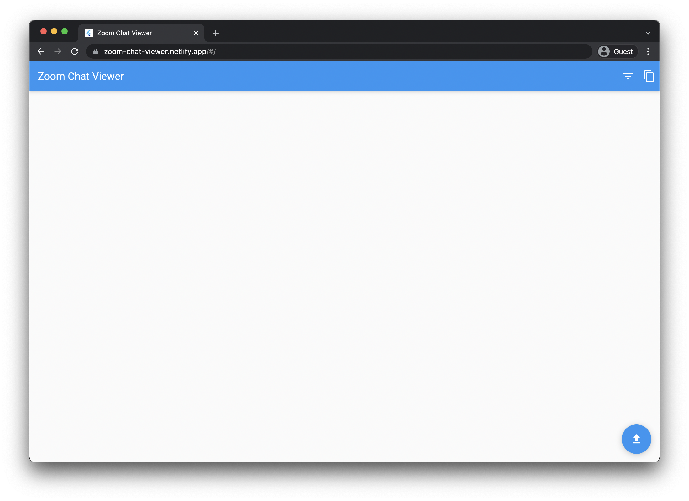

# Zoom Chat Viewer

- [Zoom Chat Viewer](#zoom-chat-viewer)
  - [Features](#features)
  - [Development](#development)
    - [Production Build](#production-build)




## Features

- Filter zoom chat by sender and receiver

## Development

### Production Build

```
flutter build web --release
```

Then upload the built folder to Netlify
